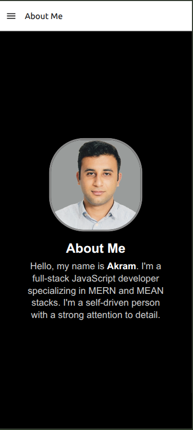

# MY APP RESUME.
This is a cross-platform React Native mobile application designed to showcase my professional portfolio.

## Features (To be expanded as the app evolves)
- 📌 Display professional experience & projects
- 🎨 Modern and responsive UI
- 📱 Works on both iOS and Android
- 🔗 Links to social profiles & contact details

## Tech Stack
- Framework: React Native
- Navigation: React Navigation
- State Management: React Hooks, Redux
- Backend: Node.js / Express.js

## Installation & Setup
1. Clone the repo.
2. Ensure you have Node.js, React Native CLI, and required dependencies installed:

## Screenshots:

### About Me:

### Menu:

### Contatct Details:

## THIS APP IS STILL IN DEVELOPMENT PHASE!